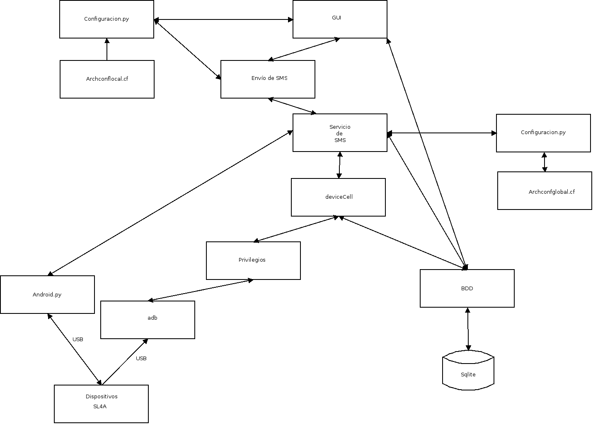

# README
##Aplicación de envío de SMS con un celular Android conectado a equipo con Sistema Operativo  Debian y Canaima

El esquema del desarrollo se muestra a continuación:

## Descripción:

* Dispositivos: Son los celulares Android que se conectan por medio de un cable USB al computador.
* adb: Es el comando del SDK de Android que permite acceder a los celulares y desde SL4A envíar SMS.
* Privilegios: Es el módulo que le da acceso al comando adb para que los dispositivos conectados, se usa el comando sudo para dicho acceso al comando. Se hace necesario configurar sudo en el equipo. Privilegios le da acceso tanto a la detección de los equipos.
* Android.py: Permite la comunicación entre el módulo de envío de sms y el celular por medio de SL4A. Módulo desarrollado por SL4A.
* deviceCell: Es un módulo que maneja la detección de los dispositivos y guarda la información en la base de datos con el estado del mismo. 
* BDD: Es el módulo que habla con la base de datos sqlite por medio del ORM Sqlalchemy.
* Configuración: Es un módulo que tiene una clase de manejo de archivos de configuración del tipo ini. 
* Archivo.conf: Maneja la configuración de la aplicación en formato ini.
* Envío de SMS: Aplicación por consola que facilita el envío de sms quien se comunica por medio de Android.py a los dispositivos.
* GUI: Es la interfaz gráfica que permite la gestión de agendas de teléfono y el envío de un mensaje de texto o multiples mensajes de texto. 
